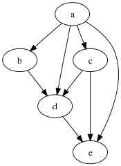
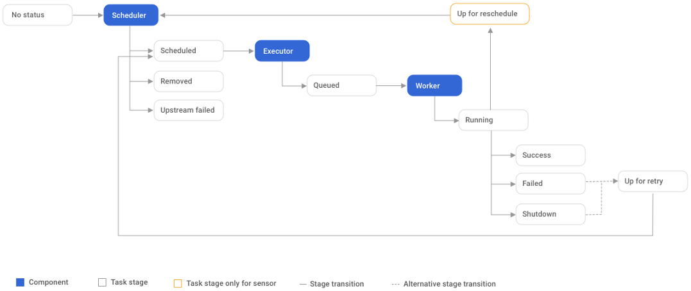

# Airflow

## Introduction

Airflow is a platform to programmatically author, schedule and monitor workflows.

---

## DAG concept

Directed Acyclic Graphs (DAGs) is a collection of all the tasks you want to run, organized in a way that reflects their relationships and dependencies.

- directed: each task has an orientation

- acyclic: no cycles or loops

- graph: structure of objects in some sense "related" each other.

.center[]

---

## DAG structure

- import modules

```airflow
# The DAG object; we'll need this to instantiate a DAG
from airflow import DAG
# Operators; we need this to operate!
from airflow.operators.bash_operator import BashOperator
from airflow.utils.dates import days_ago
```

---

- default args for all tasks (may be overridden)

```airflow
# These args will get passed on to each operator
# You can override them on a per-task basis during operator initialization
default_args = {
    'owner': 'airflow',
    'depends_on_past': False,
    'start_date': days_ago(2),
    'email': ['airflow@example.com'],
    'email_on_failure': False,
    'email_on_retry': False,
    'retries': 1,
    'retry_delay': timedelta(minutes=5),
    # 'queue': 'bash_queue',
    # 'pool': 'backfill',
    # 'priority_weight': 10,
    # 'end_date': datetime(2016, 1, 1),
    # 'wait_for_downstream': False,
    # 'dag': dag,
    # 'sla': timedelta(hours=2),
    # 'execution_timeout': timedelta(seconds=300),
    # 'on_failure_callback': some_function,
    # 'on_success_callback': some_other_function,
    # 'on_retry_callback': another_function,
    # 'sla_miss_callback': yet_another_function,
    # 'trigger_rule': 'all_success'
}
```

---

- dag instantiation: pass a string that defines the dag_id, which serves as a unique identifier for your DAG.

```airflow
dag = DAG(
    'tutorial',
    default_args=default_args,
    description='A simple tutorial DAG',
    schedule_interval=timedelta(days=1),
)
```

- tasks: these are generated when instantiating operator objects. Each task is an implementation of an Operator, for example a PythonOperator to execute some Python code, or a BashOperator to run a Bash command.

The first argument task_id (passed to the operator constructor) acts as a unique identifier for the task.

```airflow
t1 = BashOperator(
  task_id='print_date',
  bash_command='date',
  dag=dag,
)

t2 = BashOperator(
    task_id='sleep',
    depends_on_past=False,
    bash_command='sleep 5',
    retries=3,
    dag=dag,
)
```

---

## Documentation

You can add documentation for DAG or each single task.

```airflow
dag.doc_md = __doc__

t1.doc_md = """\
#### Task Documentation
You can document your task using the attributes `doc_md` (markdown),
`doc` (plain text), `doc_rst`, `doc_json`, `doc_yaml` which gets
rendered in the UI's Task Instance Details page.

"""
```

---

## Relations betweek tasks

Consider the following DAG with two tasks. Each task is a node in our DAG, and there is a dependency from task_1 to task_2:

```airflow
with DAG('my_dag', start_date=datetime(2016, 1, 1)) as dag:
    task_1 = DummyOperator('task_1')
    task_2 = DummyOperator('task_2')
    task_1 >> task_2 # Define dependencies
```

task_1 is upstream of task_2, and conversely task_2 is downstream of task_1.

When a DAG Run is created, task_1 will start running and task_2 waits for task_1 to complete successfully before it may start.

bitshift operators rather than set_upstream() and set_downstream() are the recommended way to set relationship.

```airflow
op1 >> op2
op1.set_downstream(op2)

op2 << op1
op2.set_upstream(op1)

op1 >> [op2, op3] >> op4
op1.set_downstream([op2, op3])
```

---

## Task lifecycle

A task goes through various stages from start to completion.

.left[]

---

## Operators

While DAGs describe how to run a workflow, `Operators` determine what actually gets done by a task.

An operator describes a single task in a workflow.

Operators are usually (but not always) atomic, meaning they can stand on their own and don’t need to share resources with any other operators. 

In general, if two operators need to share information, like a filename or small amount of data, you should consider combining them into a single operator. 

If it absolutely can’t be avoided, Airflow does have a feature for operator cross-communication called `XCom`.

---

## Operators (2)

Airflow provides operators for many common tasks, including:

- `BashOperator` - executes a bash command

- `PythonOperator` - calls an arbitrary Python function

- `EmailOperator` - sends an email

- `SimpleHttpOperator` - sends an HTTP request

- `MySqlOperator`, `SqliteOperator`, `PostgresOperator`, `MsSqlOperator`, `OracleOperator`, `JdbcOperator`, etc. - executes a SQL command

- `Sensor` - an Operator that waits (polls) for a certain time, file, database row, S3 key, etc…

In addition to these basic building blocks, there are many more specific operators: `DockerOperator`, `HiveOperator`, `S3FileTransformOperator`, `PrestoToMySqlTransfer`, `SlackAPIOperator`...

---

## References

- <https://airflow.apache.org/docs/stable/>

- <https://airflow.readthedocs.io>

---
